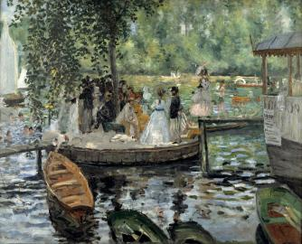
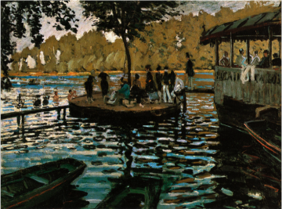

# Intro

## 1. Étymologie

Art : lat. _Ars_

$\implies$ "habileté, savoir-faire, talent"

_Ars_ traduit le grec _tekhnè_

> art manuel, industrie; d'où exercice d'une industrie, métier, profession
> (Bailly)

> Les arts de la paix. L'art oratoire, l'art de la parole. L'art musical. L'art militaire, l'art de la guerre... La logique est l'art de raisonner... Cet ouvrier est très habile dans son art.
> (Le Littré)

Dans l'étymologie d'origine, l'art ne renvoie pas essentiellement ou principalement au beau, et par extension aux "beaux-arts". Le terme "art est un terme très général pour désigner toute une partie des activités humaines, et non pas seulement les activités "artistiques" (desquelles relèvent seulement les beaux-arts)

Posséder un art, étymologiquement, c'est posséder une compétence, 

**Étymologiquement : Art = technique**

 - est-ce que l'art se réduit à la simple technique ?
 - Est-ce que le grand artiste, c'est juste un bon artisan ?
 - Quels points communs et quelles différentes entre art et technique, entre arts et beaux-arts ?

$\implies$ part d'objectivité de la maitrise technique. Mais : appréciations esthétique de la qualité : subjectif.

## 2. Histoire de l'art

Histoire, la distinction entre art et artisanat apparait seulement à la fin du XVIII$^{ème}$ siècle, avec Baumgarten (philosophe allemand) qui le premier à distinguer des "beaux-arts"

**beaux-arts** :
 1. poésie
 2. peinture
 3. sculpture
 4. architecture
 5. musique / chant

| Art plus élevé | qui a le plus essentiellement affaire à l'esprit , et donc à l'humanité elle-même.                    |
| -------------- | ----------------------------------------------------------------------------------------------------- |
| Art plus bas   | qui a le plus de points communs avec l'ordre du non−humain, de la nature, de la matière, de l'animal. |

A cette liste on peut ajouter la photographie.

# Première partie : L'art se réduit−il à la technique ?

En apparence, pas d'art sans technique. Pour produire une œuvre, un tableau, une sculpture, un morceau, il faut maitriser certaines règles sans lesquelles l'œuvre sera ratée.

**Exemple :** La cité idéale, Piero della Francesca

Pour composer l'œuvre, il faut maitriser des règles, ici, celles de la perspective, laquelle constitue une technique picturale.

**Exemple 2 :** Fresque de Pompéi tient à la différence de maitrise de la technique employée

La poésie obéit à certaines règles dont la maitrise permet l'évaluation des œuvres :
 - richesse du vocabulaire
 - des figures de style
 - des rimes
 - maitrise de la rythmique (du nombre de pied de chaque vers)
 $\implies$ d'une technique

Au théâtre : trois règles :
 - unité d'action
 - de temps
 - de lieu
 $\implies$ forment une certaine technique

Maitriser un art $\iff$ être un virtuose dans la maitrise d'une certaine technique

## 2. Que suppose la technique pour être maitrisée ?

Pratique $\neq$ théorie

| Arts    | savoirs pratiques, supposent de l'exercice pour être appris, intégrés    |
|---------|--------------------------------------------------------------------------|
| Science | savoirs théoriques, transmis, pas besoin de pratiques pour les connaitre |

Art $\neq$ Science

|   Sciences   |          savoirs théoriques $\implies$ de l'ordre de l'esprit                   |
|--------------|-------------------------------------------------------------------------|
|  Technique   | nécessité d'un but extérieur au produit : on ne développe $x$ pour rien |
|   Science    |               finalité (but) est intérieur à l'activité.                |

### a. La technique vise l'utilité tandis que l'art vise le plaisir

Technique : finalité à l'extérieur d'elle-même (on ne produit un objet technique, un stylo, un lit, etc. que parce que cela nous utile, parce qu'on en a besoin)
$\implies$
La technique répond au besoin

Au contraire, l'art répond au plaisir, il est dispensable, on peut s'en passer, on peut vivre sans.$\newline$
$\implies$ L'art a quelque chose du superflu

Peut-être que l'art suppose la technique comme préalable pour pouvoir être produit, mais il transcende la technique.

| Technique | **Moyen** en vue d'une fin extérieure |
|-----------|-----------------------------------|
| Art       | **Fin** en lui-même                   |

**Exemple :** Van Gogh : ne gagne ni argent, ni réputation, grâce à sa peinture; il continue pourtant à peindre.

### b. Reproductibilité de l'objet $\neq$ Unicité de l'œuvre d'art

Chaque œuvre d'art est uneique, tandis que les produite techniques sont indéfiniment reproductibles.

Ce qui fait la plus grande valeur d'un œuvre d'art, c'est son unicité : La rareté fait la valeur de l'œuvre d'art.

Ce critère est problématique avec l'apparition de la photo : œuvre qui peut être reproduite à l'infini. Walter Benjamin, philosophe allemand, XX, _"L'œuvre d'art à l'ère de sa reproductibilité technique"_.

L'unicité de l'œuvre implique l'originalité absolue des œuvres d'art.

**Exemple :** Renoir et Monet produisent chacun une _Grenouillère_ :

| règles techniques  | donnent leu à des productions identiques                              |
|--------------------|-----------------------------------------------------------------------|
| règles artistiques | autorisent l'invention personnelle, donnent lieu à des œuvres uniques |

| technique | affaire de **production** et de **produits**         |
|-----------|----------------------------------------------|
| art       | affaire de **creation** et **d'œuvres**              |

| règle en art       | ~~diminution de la liberté~~ vecteur de son augmentation     |
|--------------------|----------------------------------------------------------|
| règle en technique | contraingnante, débouche sur la standardisation          |

La règle en matière d'industrie (de technique) asservit le travail et le travailleur puisque celui-ci ne choisit pas ce qu'il fait ni comment il le fait, tandis que l'artiste choisit ce qu'il fait et comment il le fait et que les règles qu'il s'impose ($\neq$ qu'il subit) stimule sa créativité

A mi chemin art $\leftrightarrow$ industrie : artisanat$\newline$

